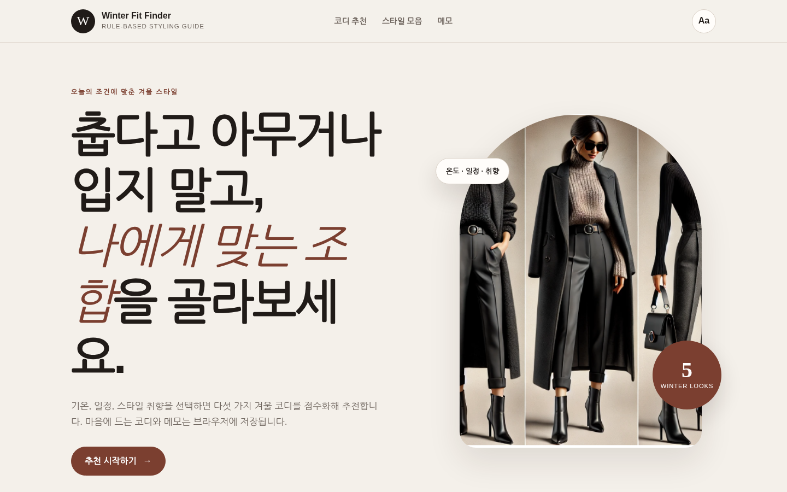
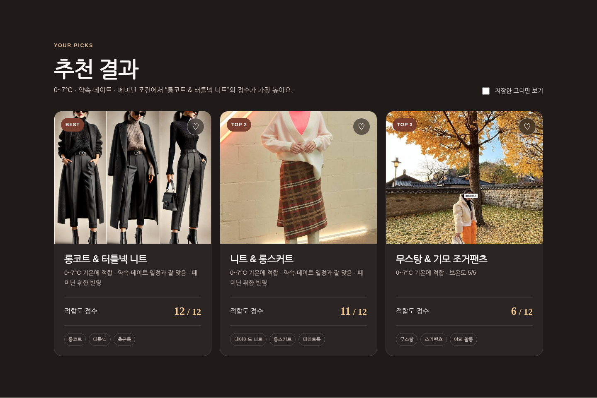
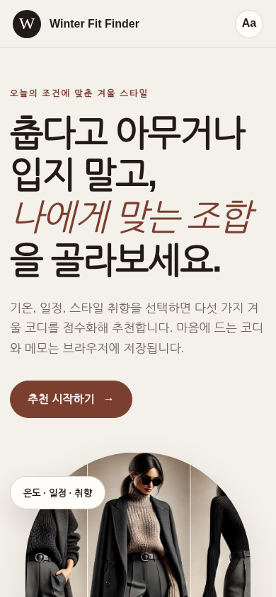

# Winter Fit Finder — 조건 기반 겨울 코디 추천 웹서비스

기온, 일정, 스타일 취향을 입력하면 다섯 가지 겨울 코디를 규칙 기반 점수로 정렬해 추천하는 반응형 웹서비스입니다. 추천 결과의 즐겨찾기, 개인 메모, 글자 크기와 고대비 설정을 브라우저 `LocalStorage`에 저장합니다.



## 프로젝트 개선 배경

초기 버전은 코디 목록을 정적으로 보여주고 제목·본문의 글꼴과 색상을 바꾸는 수업 과제였습니다. 포트폴리오 버전에서는 사용자 입력이 실제 결과를 바꾸도록 추천 로직을 추가하고, 구조와 사용성을 다음과 같이 재설계했습니다.

- 한 파일에 섞여 있던 HTML·CSS·JavaScript 분리
- 고정 폭 페이지를 모바일까지 대응하는 반응형 레이아웃으로 변경
- 기온·일정·스타일·보온 우선 여부를 반영한 점수 기반 추천 구현
- 즐겨찾기, 메모, 화면 설정의 저장·조회·삭제 기능 구현
- 시맨틱 태그, 키보드 포커스, `aria-live`, 고대비 모드 등 접근성 보완
- 이미지 파일명과 출처 문서 정리

## 핵심 기능

### 1. 규칙 기반 추천

각 코디의 속성과 사용자 선택을 비교해 최대 12점으로 점수화합니다.

| 평가 항목 | 배점 |
|---|---:|
| 기온 적합도 | 최대 4점 |
| 일정 적합도 | 최대 3점 |
| 스타일 적합도 | 최대 3점 |
| 보온 우선 가산점 | 최대 2점 |

점수가 같으면 보온도가 높은 코디를 먼저 보여주며, 추천 근거를 카드에 함께 표시합니다. 액세서리는 완성 코디를 대신해 1위를 차지하지 않도록 보조 항목으로 별도 점수화합니다. 이 결과는 학습된 추천 모델이 아니라 사전에 정의한 규칙에 따른 안내입니다.



### 2. 브라우저 상태 저장

- 즐겨찾기: 코디 카드의 하트 버튼으로 저장·해제
- 개인 메모: 최대 300자 저장 및 삭제
- 화면 설정: 글자 크기와 고대비 모드 저장
- 최근 입력 조건: 페이지 재방문 시 복원

모든 정보는 서버가 아닌 현재 브라우저의 `LocalStorage`에 저장됩니다.

### 3. 반응형·접근성 UI

- 데스크톱, 태블릿, 모바일 레이아웃
- 키보드 포커스 표시와 본문 바로가기 링크
- 추천 결과 변경 내용을 스크린 리더에 알리는 `aria-live`
- 이미지 대체 텍스트, 시맨틱 `header`, `main`, `section`, `article`, `footer`
- `prefers-reduced-motion` 및 고대비 화면 설정 대응



## 기술 스택

- HTML5
- CSS3: Grid, Flexbox, Custom Properties, Media Queries
- Vanilla JavaScript: DOM, Event Handling, LocalStorage, Array Methods

외부 프레임워크나 서버 없이 정적 파일만으로 실행됩니다.

## 프로젝트 구조

```text
.
├── index.html
├── styles.css
├── script.js
├── README.md
├── .gitignore
└── assets/
    ├── IMAGE_SOURCES.md
    ├── images/
    │   ├── long-coat-sweater.png
    │   ├── shearling-joggers.jpg
    │   ├── knit-long-skirt.jpg
    │   ├── winter-cardigan.jpg
    │   ├── winter-hats.png
    │   ├── winter-mufflers.png
    │   └── winter-gloves.png
    └── screenshots/
        ├── desktop.png
        ├── recommendation.png
        └── mobile.png
```

## 실행 방법

별도 설치 없이 `index.html`을 열어도 기본 기능을 확인할 수 있습니다. 로컬 서버를 사용하면 브라우저 저장 기능과 경로 처리를 더 안정적으로 확인할 수 있습니다.

```bash
python -m http.server 8000
```

브라우저에서 `http://localhost:8000`에 접속합니다.

## 구현에서 고려한 점

- 이벤트 핸들러를 HTML 속성에 작성하지 않고 JavaScript에서 일괄 등록했습니다.
- 추천 데이터와 화면 렌더링을 분리해 코디 항목 추가 시 데이터 객체만 확장할 수 있도록 구성했습니다.
- LocalStorage 접근 실패를 대비해 예외 처리를 추가했습니다.
- 추천 점수와 추천 근거를 함께 보여주어 규칙의 동작을 확인할 수 있게 했습니다.

## 한계와 향후 개선

- 추천 점수는 사용자 행동 데이터로 학습한 값이 아니라 제작자가 정한 규칙입니다.
- 실제 날씨 API, 상품 재고, 체형, 소재, 사용자의 기존 옷장은 반영하지 않습니다.
- 이미지 라이선스는 상업적 배포 전에 별도 확인이 필요합니다. 자세한 출처는 [`assets/IMAGE_SOURCES.md`](assets/IMAGE_SOURCES.md)에 정리했습니다.
- 이후에는 선택·즐겨찾기 로그를 익명 데이터로 수집하고, 사용자 피드백을 이용해 추천 가중치를 검증할 수 있습니다.
