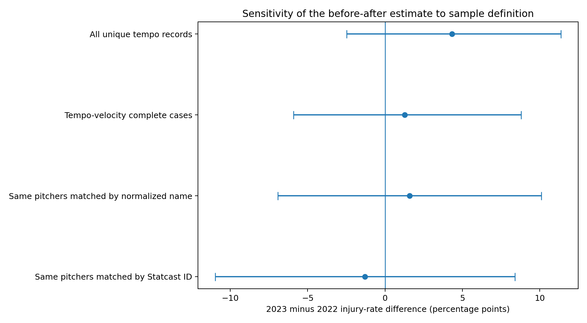
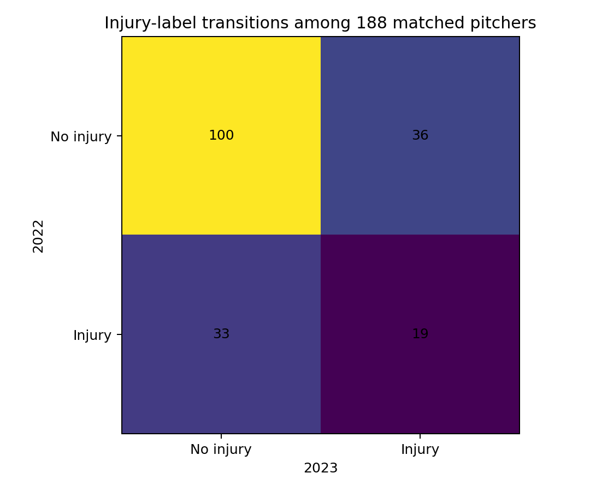
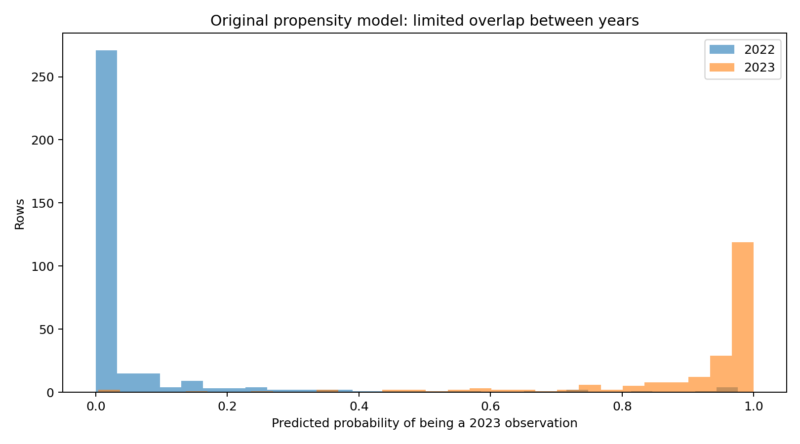
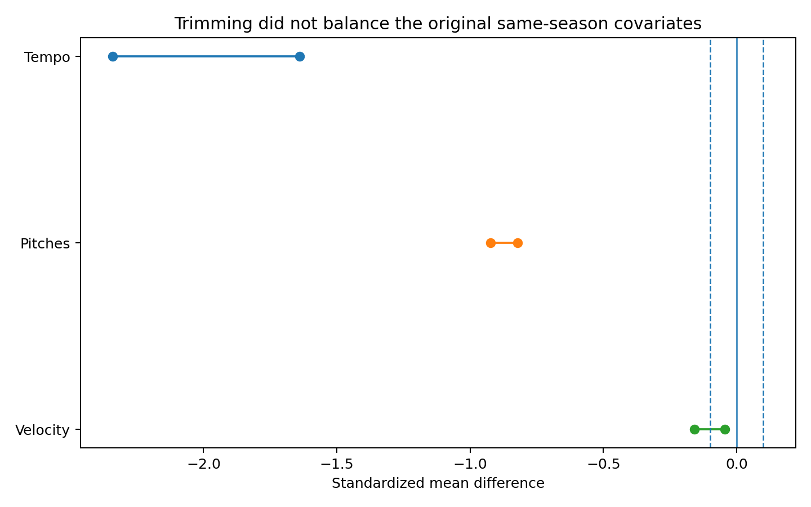

# MLB 피치클락 도입 전후 투수 부상률 분석 및 인과 식별 진단

> **Observational Before–After Analysis and Causal Identification Audit**

## 프로젝트 개요

2023년 MLB 피치클락 도입 전후의 투수 부상 라벨을 비교하고, 동일 투수 패널·완전 사례 표본·성향점수 진단을 통해 결과가 분석 설계에 얼마나 민감한지 확인한 프로젝트입니다.

이 프로젝트는 기존의 `피치클락으로 부상 확률이 20.8% 증가했다`는 결론을 유지하지 않습니다. 업로드된 데이터에는 2023년의 동시기 비노출 비교군이 없고, 기존 성향점수 모형이 사용한 템포·투구 수·구속이 모두 같은 시즌에 측정되어 인과효과를 식별하기 어렵기 때문입니다.

## 핵심 질문

1. 중복을 제거한 선수 단위 자료에서 2022년과 2023년 부상률은 얼마나 달랐는가?
2. 두 시즌에 모두 등장한 동일 투수만 비교해도 결과가 유지되는가?
3. 구속 자료 결합으로 인한 완전 사례 선택이 결과를 바꾸는가?
4. 기존 성향점수 분석은 공통지지와 공변량 균형을 확보했는가?

## 데이터

- 2022년 투구 템포 원본: 391행, 391명
- 2023년 투구 템포 원본: 251행, 250명
- 원본 구속 자료: 2022년 352명, 2023년 361명
- 2023년 중복 선수 1명은 투구 수로 가중한 템포와 합산 투구 수로 한 행에 통합
- 템포·구속 결합 표본: 2022년 348명, 2023년 211명
- 병합 자료의 Statcast ID와 대표 구속은 원본 구속 자료와 전 행 일치
- 두 시즌 공통 선수: 이름 기준 188명, Statcast ID 기준 155명

투구 템포와 구속 자료는 MLB Baseball Savant / Statcast 형식과 일치합니다. 다만 파일의 이진 부상 라벨에는 원천 명단, 부상 판정 기준, 발생일이 포함되지 않아 독립적으로 검증하지 못했습니다.

또한 Baseball Savant의 pitch tempo는 투구 릴리스 간 시간이며 MLB pitch timer가 직접 재는 구간과 동일하지 않습니다.

- MLB pitch timer rule: https://www.mlb.com/glossary/rules/pitch-timer
- Baseball Savant pitch tempo: https://baseballsavant.mlb.com/leaderboard/pitch-tempo
- Statcast search: https://baseballsavant.mlb.com/statcast_search

## 분석 방법

### 1. 전체 선수 전후 비교

중복을 제거한 연도별 고유 선수 표본에서 부상률, 위험도 차이, 위험비를 계산했습니다. 위험도 차이는 Newcombe 95% 신뢰구간, 집단 차이는 Fisher의 정확검정을 사용했습니다.

### 2. 동일 투수 패널

두 시즌에 모두 등장한 투수 188명을 이름으로 매칭해 전후 부상 라벨을 비교했습니다. 동일 선수의 이진 결과이므로 McNemar의 정확검정을 사용하고 위험도 차이는 선수 단위 부트스트랩으로 신뢰구간을 계산했습니다.

### 3. 표본 민감도 분석

- 전체 템포 표본
- 구속 자료가 결합된 완전 사례 표본
- 이름 기준 동일 투수 패널
- Statcast ID 기준 동일 투수 패널

네 가지 분석에서 위험도 차이의 방향과 크기를 비교했습니다.

### 4. 기존 성향점수 설계 감사

기존 노트북과 같은 `Tempo + same-season Pitches + same-season Velocity` 로지스틱 모형을 재현해 연도 분리 정도, 공통지지, 트리밍 전후 표준화 평균 차이를 점검했습니다. 이 모형은 인과효과 추정에 사용하지 않고 설계의 한계를 보여주는 진단으로만 사용했습니다.

## 핵심 결과

| 분석 | 2022 부상률 | 2023 부상률 | 위험도 차이 | 95% 신뢰구간 | p-value |
|---|---:|---:|---:|---:|---:|
| 전체 고유 선수 | 23.27% | 27.60% | +4.33%p | -2.49%p ~ +11.36%p | 0.225 |
| 템포·구속 완전 사례 | 23.85% | 25.12% | +1.27%p | -5.90%p ~ +8.79%p | 0.761 |
| 동일 투수 188명 | 27.66% | 29.26% | +1.60%p | -6.91%p ~ +10.11%p | 0.810 |
| Statcast ID 동일 투수 155명 | 27.74% | 26.45% | -1.29%p | -10.97%p ~ +8.39%p | 0.894 |

전체 고유 선수 표본의 위험도 차이는 약 **+4.33%p**였으나 95% 신뢰구간이 0을 포함했습니다. 동일 투수 패널에서도 뚜렷한 전후 차이가 확인되지 않았습니다. 완전 사례 선택과 매칭 기준에 따라 추정치가 달라져, 결과가 표본 정의에 민감함을 확인했습니다.





## 기존 성향점수 분석을 인과효과로 사용하지 않은 이유

- 처치가 연도와 완전히 결합되어 있으며 2023년 동시기 비노출 MLB 비교군이 없습니다.
- 템포는 피치클락의 영향을 받는 중간 변수입니다.
- 같은 시즌 총 투구 수는 부상 발생 이후 줄어들 수 있습니다.
- 성향점수 모형의 연도 분류 AUC는 **0.989**였습니다.
- 원래 공통지지 규칙은 **330행**을 제거했고 **230행**만 남겼습니다.
- 트리밍 이후 표준화 평균 차이는 아래와 같이 큰 불균형이 남았습니다.

| 변수 | 트리밍 전 SMD | 트리밍 후 SMD | 절대 SMD < 0.1 |
|---|---:|---:|:---:|
| Tempo | -2.340 | -1.640 | No |
| Pitches | -0.923 | -0.821 | No |
| Velocity | -0.045 | -0.158 | No |





## 결론

이 데이터는 `2022년과 2023년의 부상 라벨 차이`를 기술할 수 있지만, 피치클락의 인과효과를 분리해 추정할 설계 조건은 충족하지 못했습니다. 따라서 최종 결론은 다음과 같습니다.

> 업로드된 자료에서 2023년 부상률이 더 높게 나타나는 분석도 있었으나, 신뢰구간이 넓고 동일 투수·완전 사례·ID 패널에 따라 추정치가 달라졌다. 이 결과를 피치클락의 인과효과로 해석할 수 없다.

## 프로젝트 구조

```text
.
├── README.md
├── MLB_Pitch_Clock_Analysis.ipynb
├── requirements.txt
├── .gitignore
├── data/
│   ├── README.md
│   └── raw/
│       ├── 2022_pitch_tempo.csv
│       ├── 2023_pitch_tempo.csv
│       ├── 2022_pitch_velocity.csv
│       ├── 2023_pitch_velocity.csv
│       ├── 2022_merged_data.csv
│       └── 2023_merged_data.csv
└── outputs/
    ├── analysis_sample.csv
    ├── matched_player_panel.csv
    ├── matched_player_id_panel.csv
    ├── effect_estimates.csv
    ├── data_audit.csv
    ├── merge_retention_by_injury.csv
    ├── baseline_workload_sensitivity.csv
    ├── propensity_score_audit.csv
    ├── covariate_balance.csv
    ├── causal_identification_checklist.csv
    └── figures/
        ├── injury_rates_by_year.png
        ├── effect_estimates_forest.png
        ├── matched_injury_transitions.png
        ├── propensity_score_overlap.png
        ├── covariate_balance.png
        ├── sample_flow.png
        └── matched_tempo_change.png
```

## 실행 방법

```bash
pip install -r requirements.txt
jupyter notebook MLB_Pitch_Clock_Analysis.ipynb
```

노트북에서 `Restart Kernel and Run All`을 실행하면 모든 CSV와 그래프가 `outputs/`에 다시 생성됩니다.

## 기술 스택

- Python standard library (`csv`, `pathlib`)
- NumPy, SciPy
- Statsmodels
- Scikit-learn
- Matplotlib

## 한계와 다음 단계

- 부상 라벨의 출처와 판정 기준이 제공되지 않았습니다.
- 연도별 데이터 추출 설정과 최소 투구 수 기준이 기록되지 않아 두 표본이 같은 자격 기준으로 구성됐는지 확인할 수 없습니다.
- 2022년 한 해와 2023년 한 해만 있어 일반적인 연도 효과와 피치클락 효과를 분리할 수 없습니다.
- 나이, 과거 부상, 보직, 이닝, 휴식일, 구단 의료 정보 등 중요한 처치 이전 변수가 없습니다.
- Baseball Savant pitch tempo는 실제 pitch timer와 같은 측정 구간이 아닙니다.
- 더 나은 설계를 위해 여러 도입 전·후 시즌, 명확한 부상 발생일, 적절한 동시기 비교군, 사전 추세 검정이 필요합니다.
