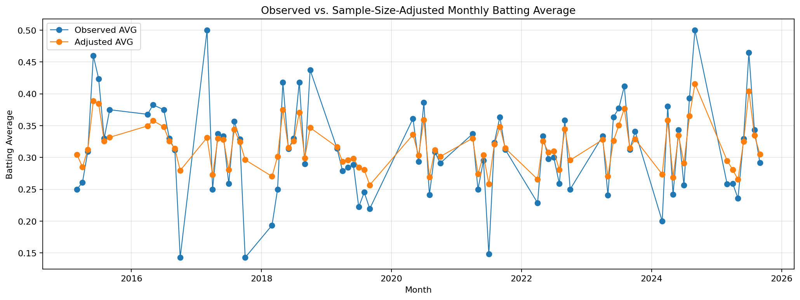
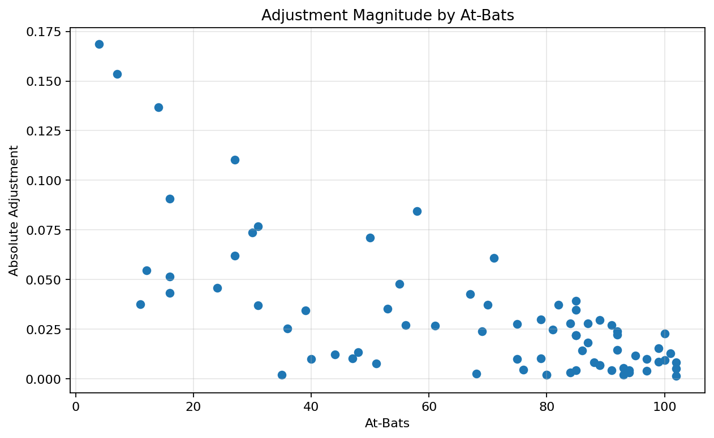

# KBO 월별 타격 데이터 표본 크기 보정 및 SQLite 분석 파이프라인

## 프로젝트 개요

구자욱 선수의 2015–2025년 월별 타격 기록 77건을 정제하고, 타수가 적은 달의 관측 타율이 크게 흔들리는 문제를 베타-이항 축소 추정으로 보정했습니다. 최종 데이터는 CSV와 SQLite로 저장했으며, SQL 쿼리로 월별·연도별 성적과 보정 폭이 큰 기록을 조회했습니다.

[분석 노트북](./KBO_Monthly_Analysis.ipynb) · [SQL 쿼리](./analysis_queries.sql) · [전처리 결과 CSV](./outputs/kbo_monthly_processed.csv)

## 문제 정의

월별 타율은 표본 크기가 서로 다릅니다. 예를 들어 `4타수 2안타(0.500)`와 `100타수 30안타(0.300)`는 관측 타율만 보면 전자가 높지만, 두 값을 같은 수준의 근거로 해석하기는 어렵습니다. 이 프로젝트에서는 타수가 적을수록 분석 기간 전체의 가중 타율 쪽으로 더 크게 조정해 월별 성적을 보수적으로 해석했습니다.

## 수행 내용

1. 연도 결측값 보완 및 연도·월 기준 정렬
2. 자료형, 중복, 결측, `안타 ≤ 타수`, 타율 재계산 검증
3. 전체 기간 가중 타율을 사전 평균으로 사용한 베타-이항 축소 추정
4. 95% 신용구간과 관측값 반영 비중 산출
5. 사전 강도 25·50·100에 대한 민감도 점검
6. 최종 데이터를 CSV와 SQLite에 적재
7. SQL을 이용한 월별 가중 타율, 연도별 성적, 보정 폭 상위 기록 조회

## 핵심 결과

- 77개 월별 기록의 합계는 1,656안타, 5,210타수이며 전체 기간 가중 타율은 약 `0.318`입니다.
- 2017년 3월 `4타수 2안타(0.500)`는 표본이 매우 작아 조정 타율이 약 `0.331`로 이동했습니다.
- 2025년 7월 `71타수 33안타(0.465)`는 더 많은 타수가 확보되어 조정 후에도 약 `0.404`를 유지했습니다.
- SQL의 월별 통산 관측 타율은 `AVG(월별 타율)`이 아니라 `SUM(안타) / SUM(타수)`로 계산해 각 기록의 표본 크기를 반영했습니다.





## 데이터

- 기간: 2015–2025년
- 분석 단위: 선수·연도·월
- 원본 행 수: 77
- 원본 열 수: 29
- 원본 파일: `kjw.xlsx`
- 수집 출처: STATIZ 구자욱 선수 상황별 기록

## 분석 방법

관측 타율을 `H / AB`, 전체 기간 가중 타율을 `p0`, 사전 강도를 `k=50`으로 두었습니다.

```text
adjusted_avg = (H + k × p0) / (AB + k)
```

이는 아래와 같이 해석할 수 있습니다.

```text
observed_weight = AB / (AB + k)
adjusted_avg = observed_weight × observed_avg
             + (1 - observed_weight) × p0
```

타수가 많을수록 해당 월의 관측 타율을 더 많이 반영하고, 타수가 적을수록 전체 기간 가중 타율 쪽으로 더 크게 조정합니다. `k=50`은 해석을 위한 기준값이며, 최적값으로 검증된 값은 아닙니다. 이에 따라 `k=25`, `50`, `100`에서 결과가 얼마나 달라지는지도 함께 확인했습니다.

## 프로젝트 구조

```text
.
├── README.md
├── KBO_Monthly_Analysis.ipynb
├── kjw.xlsx
├── analysis_queries.sql
├── requirements.txt
├── .gitignore
└── outputs/
    ├── kbo_monthly_processed.csv
    ├── kbo_monthly.db
    └── figures/
        ├── observed_vs_adjusted.png
        └── adjustment_by_at_bats.png
```

## 실행 방법

```bash
pip install -r requirements.txt
jupyter notebook KBO_Monthly_Analysis.ipynb
```

노트북에서 `Restart Kernel and Run All`을 실행하면 CSV, SQLite 데이터베이스, 그래프가 `outputs/`에 생성됩니다.

## 기술 스택

- Python
- Pandas, NumPy, SciPy
- Matplotlib
- SQLite, SQL

## 한계

- 상대 투수, 구장, 부상, 타순 등 상황 변수를 반영하지 않았습니다.
- 월별 기록은 시간적으로 서로 연관될 수 있습니다.
- 사전 평균은 분석 대상 전체 기록에서 추정했으므로 외부 데이터에 기반한 독립 기준은 아닙니다.
- 조정 타율은 표본 크기를 반영한 기술적 추정치이며, 미래 성적을 보장하는 예측값이 아닙니다.
