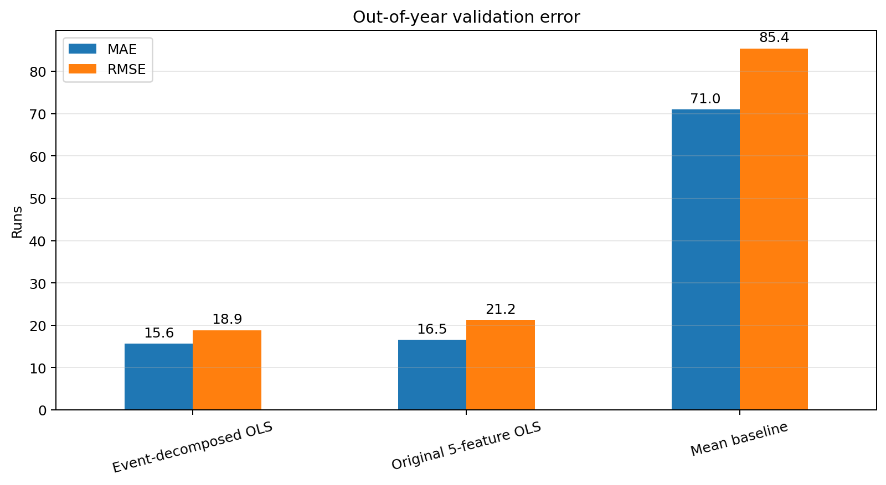
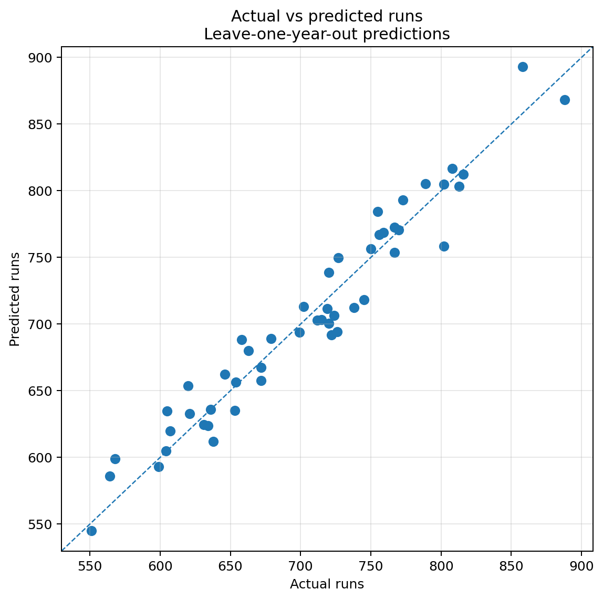
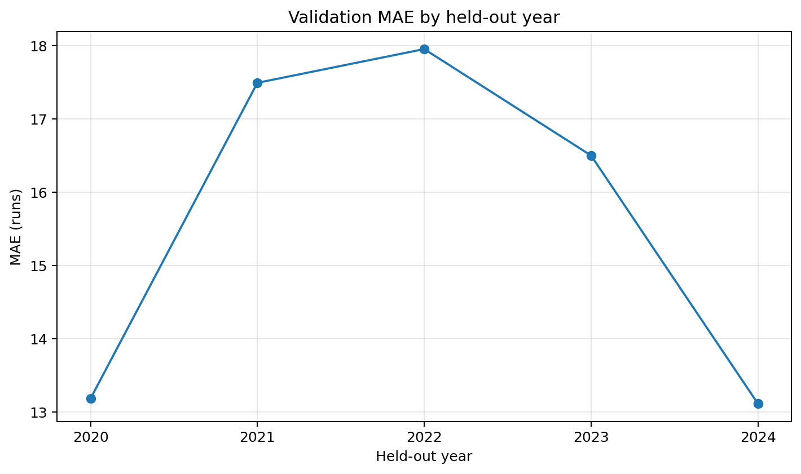
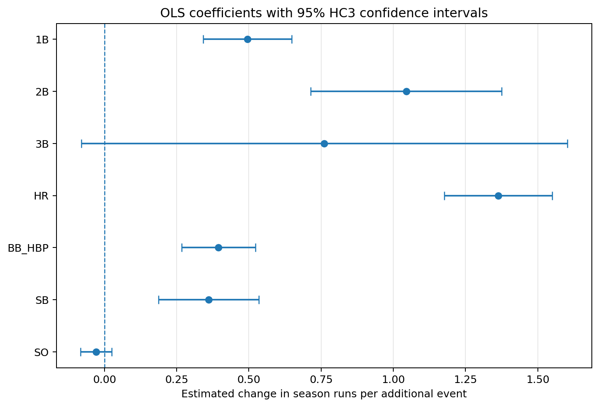
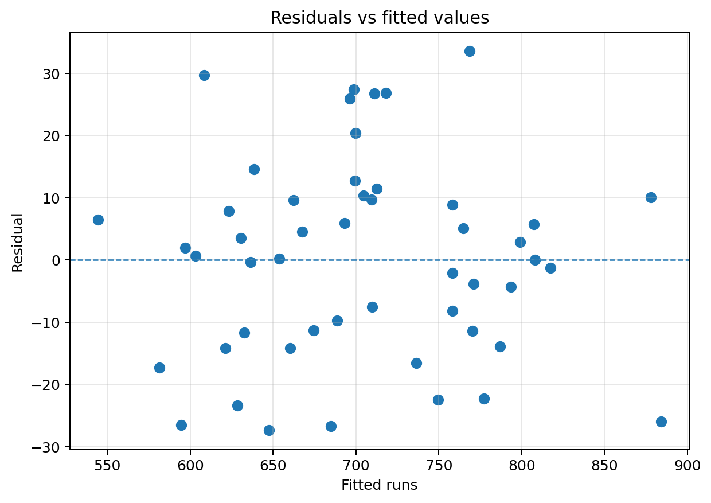
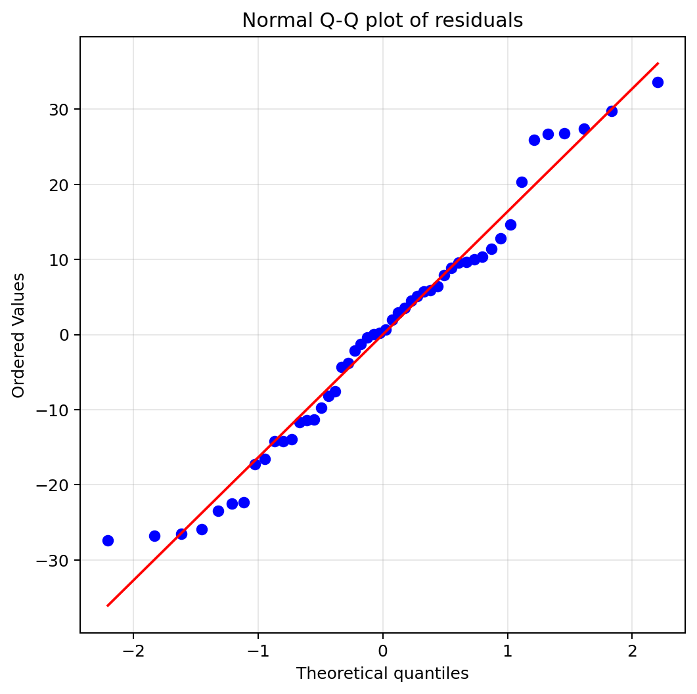

# KBO 팀 득점 추정 모델: 공격 이벤트 분해와 연도별 교차검증

## 프로젝트 개요

2020–2024년 KBO 10개 구단의 팀 시즌 타격 기록 50건을 이용해 공격 이벤트와 시즌 득점의 선형 관계를 분석했습니다. 기존 모형의 `안타(H) + 홈런(HR)` 구조는 홈런이 안타에 포함된다는 해석상 중복이 있어, 안타를 1루타·2루타·3루타·홈런으로 분해했습니다.

모형의 성능은 같은 데이터에 적합한 결정계수만으로 평가하지 않고, 한 연도를 통째로 제외하는 **Leave-One-Year-Out 교차검증**으로 확인했습니다.

## 핵심 질문

1. 기존 5변수 모형보다 공격 이벤트를 분해한 모형이 보지 못한 연도에서 더 안정적인가?
2. 각 공격 이벤트는 다른 변수를 통제했을 때 시즌 득점과 어떤 선형 관계를 보이는가?
3. 잔차, 다중공선성, 영향점 관점에서 OLS 해석이 얼마나 안정적인가?

## 데이터

- 기간: 2020–2024년
- 단위: 구단·시즌
- 관측치: 50건, 연도별 10개 구단
- 원본 열 수: 88개
- 분석 대상: 원본 파일의 팀 타격 기록 구간
- 원본 파일: `team_records.xlsx`
- 출처: STATIZ 팀기록실 타격 기록 (`https://www.statiz.co.kr/stats/?m=team`)

### 전처리

- 팀명 앞의 비표준 공백 제거
- `SK` 표기를 `SSG`로 통일
- `1B = H - 2B - 3B - HR` 파생
- `BB_HBP = BB + HP` 파생
- 팀·연도 중복, 결측값, 경기 수, 음수 1루타 여부 검증

## 모형 비교

| 모형 | 변수 |
|---|---|
| 평균 기준선 | 학습 연도의 평균 득점 |
| 기존 5변수 OLS | H, HR, BB, SB, SO |
| 이벤트 분해 OLS | 1B, 2B, 3B, HR, BB+HP, SB, SO |

홈런은 안타에 포함되므로 기존 모형의 `H`와 `HR` 계수를 함께 해석하기 어렵습니다. 이벤트 분해 모형은 타격 결과를 서로 배타적인 범주로 나눠 계수의 의미를 명확히 했습니다.

## 검증 결과

### Leave-One-Year-Out 교차검증

| 모형 | MAE | RMSE | Out-of-fold R² |
|---|---:|---:|---:|
| 평균 기준선 | 70.96 | 85.38 | -0.207 |
| 기존 5변수 OLS | 16.52 | 21.25 | 0.925 |
| **이벤트 분해 OLS** | **15.65** | **18.85** | **0.941** |

이벤트 분해 모형의 연도별 교차검증 평균 절대오차는 약 **15.65점**, 평균 제곱근 오차는 약 **18.85점**이었습니다. 기존 5변수 모형보다 MAE와 RMSE가 모두 낮았습니다.

2024년을 검증 세트로 둔 시간 순서 확인에서는 2020–2023년으로 학습한 모형이 다음 성능을 보였습니다.

- MAE: **13.11점**
- RMSE: **16.89점**
- R²: **0.863**







## 최종 OLS 진단

전체 50개 관측치에 이벤트 분해 모형을 적합하고 HC3 강건 표준오차를 사용했습니다. 전체 표본 적합도의 결정계수는 `0.958`, 수정 결정계수는 `0.951`였지만, 성능 해석은 앞의 교차검증 결과를 우선합니다.

- 최대 VIF: **2.11**
- 표준화 설명변수 기준 조건수: **2.66**
- Breusch–Pagan 검정 p-value: **0.354**
- Jarque–Bera 검정 p-value: **0.598**
- Cook's distance가 `4/n`을 넘은 관측치: **4건**
- 해당 관측치 제외 민감도 분석에서 모든 계수의 부호 유지: **유지됨**







## 결과 해석

1루타, 2루타, 홈런, 볼넷·몸에 맞는 공, 도루는 현재 모형에서 시즌 득점과 양의 선형 관계를 보였습니다. 다만 이는 팀-시즌 집계자료에서 확인된 **조건부 연관성**이며, 각 이벤트의 인과적 득점 가치를 뜻하지 않습니다.

3루타 계수의 95% 신뢰구간은 0을 포함해 추정 불확실성이 상대적으로 컸습니다.

삼진의 HC3 p-value는 `0.293`였습니다. 따라서 현재 표본과 변수 구성에서는 다른 공격 이벤트를 통제한 삼진의 독립적인 선형 관계를 뚜렷하게 확인하지 못했습니다. 이는 “삼진은 득점과 무관하다”는 증명이 아닙니다.

## 프로젝트 구조

```text
.
├── README.md
├── KBO_Run_Analysis.ipynb
├── team_records.xlsx
├── requirements.txt
├── .gitignore
└── outputs/
    ├── kbo_team_batting_processed.csv
    ├── model_comparison.csv
    ├── validation_metrics_by_year.csv
    ├── cross_validated_predictions.csv
    ├── coefficient_table.csv
    ├── vif_table.csv
    ├── diagnostics_summary.csv
    ├── influential_observations.csv
    ├── coefficient_sensitivity.csv
    └── figures/
        ├── model_comparison.png
        ├── actual_vs_predicted.png
        ├── validation_by_year.png
        ├── coefficient_intervals.png
        ├── residuals_vs_fitted.png
        └── qq_plot.png
```

## 실행 방법

```bash
pip install -r requirements.txt
jupyter notebook KBO_Run_Analysis.ipynb
```

노트북에서 `Restart Kernel and Run All`을 실행하면 전처리 CSV, 검증 결과, 진단표, 그래프가 `outputs/`에 다시 생성됩니다.

## 기술 스택

- Python
- Pandas, NumPy
- Scikit-learn
- Statsmodels, SciPy
- Matplotlib

## 한계

- 표본은 5개 시즌, 50개 팀-시즌으로 제한됩니다.
- 구단이 여러 연도에 반복되므로 관측치가 완전히 독립적이지 않을 수 있습니다.
- 주자 상황, 타순, 구장, 상대 투수, 득점권 성과 등 중요한 변수가 포함되지 않았습니다.
- Leave-One-Year-Out 중 2020–2023년 폴드는 미래 연도가 학습 데이터에 포함될 수 있어 순수한 시계열 백테스트가 아닙니다. 2024년 폴드만 시간 순서를 지킨 별도 확인값입니다.
- 회귀계수는 인과효과가 아니며, 다른 기간과 리그 환경에는 추가 검증 없이 일반화할 수 없습니다.
